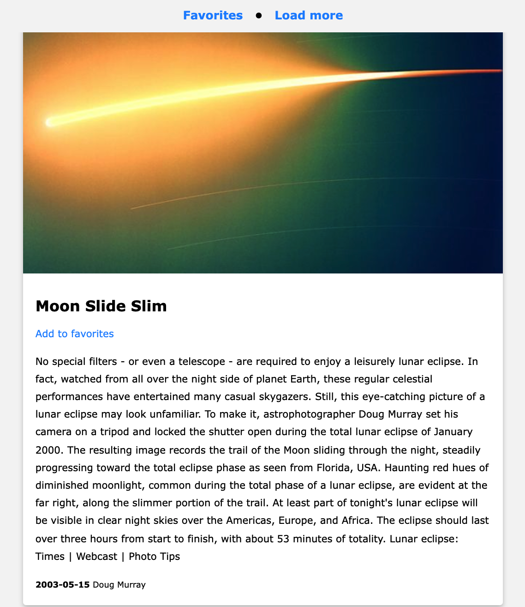
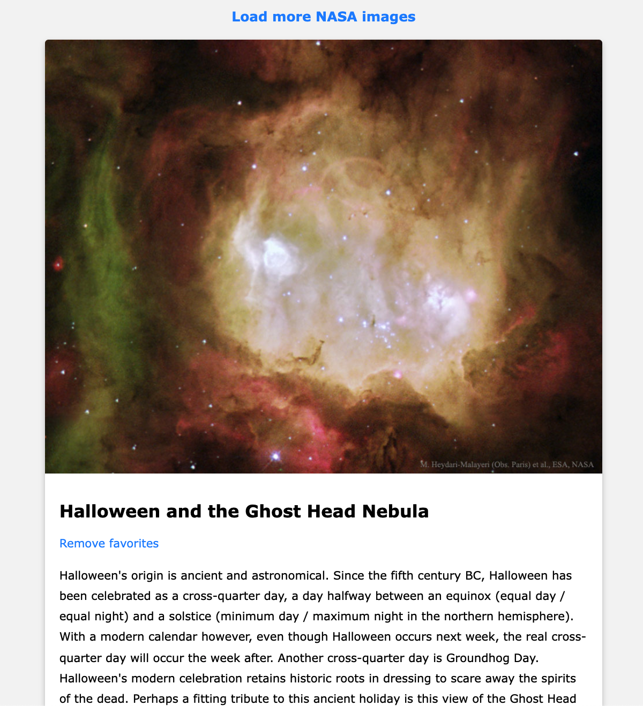

## NASA APOD API consuming

A Vanilla JS app to consume NASA API public available pictures.

## Constraints

> The amount of possible download images from NASA API depends on an API key limitation. Please check [NASA API webpage](https://api.nasa.gov/) for additional information.

## Features

- Lazy load configurable amount of images
- Add animated loader between each API image loading
- Add picture to favorites
- Remove picture from favorites
- Persist favorites between browser refresh
- Mobile reponsive

## Images

